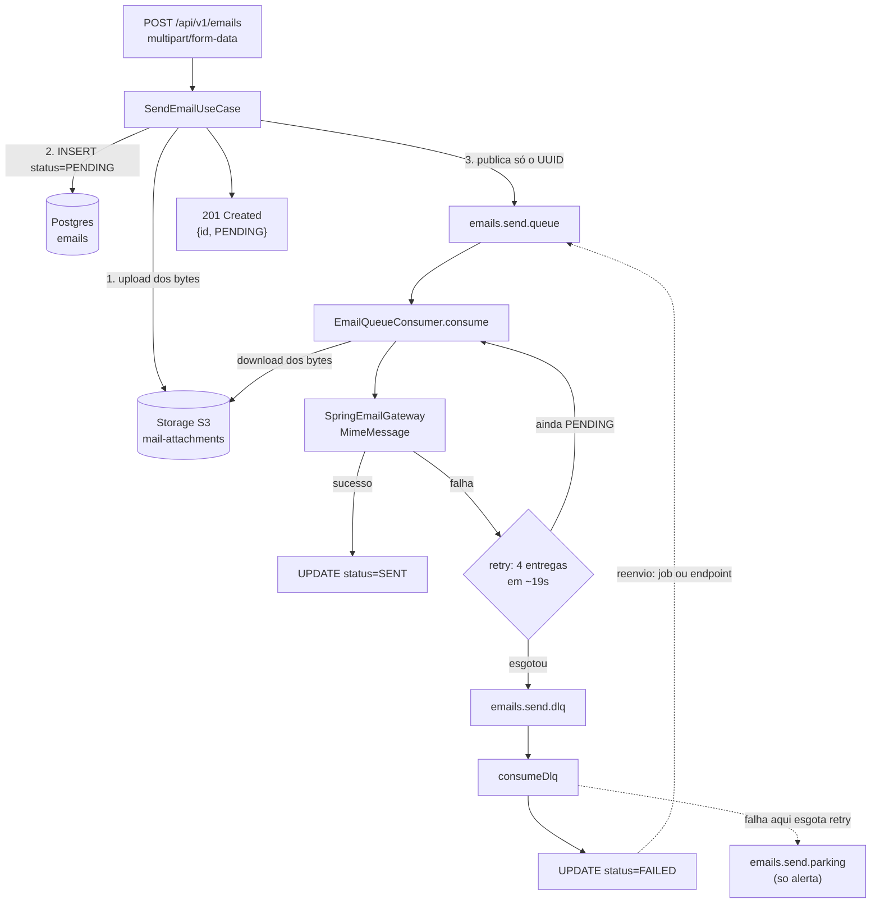

# Manual técnico — mailsender

Microserviço de envio assíncrono de e-mail com anexos. Java 25 / Spring Boot 4.0.2, arquitetura hexagonal.

A API recebe a requisição e responde imediatamente; o envio acontece depois, num consumidor de fila. Os anexos vão para um storage S3 (Ceph RGW ou MinIO) e o registro do e-mail para o Postgres. A fila carrega apenas o UUID do e-mail — nunca os bytes.

Este manual narra os passos em ordem. Para as regras de estilo e as armadilhas de edição, veja `CLAUDE.md`.

---

## 1. Subir o ambiente

### 1.1. Infraestrutura

```bash
docker compose up -d
```

Sobe quatro serviços:

| Serviço | Portas | Observação |
|---|---|---|
| `rabbitmq:4.0-management` | 5672, **15672** (UI) | `guest/guest` |
| `minio` | 9000, 9001 (console) | `minioadmin/minioadmin` |
| `createbuckets` | — | job efêmero: cria o bucket `mail-attachments` e sai |
| `postgres:17-alpine` | 5432 | banco `mailsender_db` |

### 1.2. Variáveis de ambiente

```bash
cp .envsample .env
```

**`application.yml` não tem valores default: toda variável é obrigatória.** Se faltar uma, o contexto do Spring nem sobe — a falha é `PlaceholderResolutionException` no startup.

Quem carrega o arquivo é a lib `spring-dotenv`, e ela lê **somente `.env`**. Um `.env-local` na pasta não é carregado; serve como sua cópia de referência local.

| Grupo | Alimenta |
|---|---|
| `RABBITMQ_*` | conexão com o broker |
| `MAIL_*` | servidor SMTP de saída |
| `SPRING_DATASOURCE_*`, `SPRING_JPA_PROPERTIES_HIBERNATE_DIALECT` | Postgres (datasource, JPA e Flyway) |
| `CEPH_*` | storage de anexos (Ceph RGW ou MinIO — o adapter fala S3 com os dois) |

> Para apontar o storage ao MinIO local do compose, preencha as `CEPH_*` com `http://localhost:9000` e `minioadmin`. O `S3StorageConfig` usa `forcePathStyle`, que serve para os dois.

### 1.3. Rodar

```bash
./mvnw spring-boot:run
```

A aplicação sobe na porta **8081**.

### 1.4. Banco

O Flyway roda no startup e aplica `src/main/resources/db/migration/V1__Initial_setup.sql`, criando `emails` e `email_attachments`. `baseline-on-migrate=true` e `ddl-auto=none`: **o Hibernate nunca gera schema** — toda mudança de estrutura é uma migration nova.

### 1.5. Validar

```bash
curl http://localhost:8081/api/v1/emails/health
```

Ou abra `api.http`, que tem quatro requests prontos (health, texto simples, HTML, HTML com múltiplos anexos) — também disponíveis como run configs do IntelliJ.

---

## 2. Os passos de um e-mail



### 2.1. Entrada — do POST ao 201

| # | Passo | Onde |
|---|---|---|
| 1 | `POST /api/v1/emails` com `multipart/form-data`, ligado ao record `SendEmailRequest(to, subject, body, isHtml, attachments)` via `@ModelAttribute` | `EmailController.java:25` |
| 2 | `Email.of(to)` valida contra regex e normaliza: `trim()` e depois `toLowerCase()`. Inválido → `IllegalArgumentException` | `Email.java` |
| 3 | Valida a **soma** dos anexos contra o orçamento derivado do limite do provedor (ver 2.3); passando, cada `MultipartFile` vira um `EmailAttachment.fromUpload` com os bytes em memória | `SendEmailUseCase.java` |
| 4 | `EmailMessage.create(...)` nasce **`PENDING`**, com UUID gerado e `createdAt` | `EmailMessage.java` |
| 5 | Para cada anexo: `upload(emailId, nome, bytes)` → chave `{emailId}/{filename}` no bucket `mail-attachments`; a chave volta e é gravada no `storagePath` do anexo | `S3AttachmentStorageAdapter.java` |
| 6 | `saveAndFlush` do agregado, mapeado para `EmailJpaEntity` + `EmailAttachmentJpaEntity` | `EmailJpaAdapter.java` |
| 7 | Publica `EmailEnqueuedEvent(id)` em `emails.exchange` com routing key `emails.send.key` | `SendEmailUseCase.java` |
| 8 | Responde `201 Created`, header `Location: /api/v1/emails/{id}`, corpo `{id, status: "PENDING"}` | `EmailController.java:28` |

**A ordem 5 → 6 → 7 é significativa, não incidental.** O anexo tem de existir no storage *antes* da linha do banco que aponta para ele, e a mensagem só pode ser publicada *depois* de o registro estar gravado. Invertido, o consumidor encontraria um `storagePath` apontando para nada, ou um id que ainda não existe no banco. Há um teste `inOrder` em `SendEmailUseCaseTest` fixando essa sequência.

### 2.2. Consumo — da fila ao SENT

| # | Passo | Onde |
|---|---|---|
| 9 | `consume` escuta `emails.send.queue` (2 a 5 consumidores concorrentes, `prefetch: 1`) | `EmailQueueConsumer.java` |
| 10 | Busca o registro pelo id. **Guarda de idempotência:** se o status não for `PENDING`, loga e retorna — entrega duplicada não reenvia e-mail | `EmailQueueConsumer.java` |
| 11 | Rehidrata os anexos: `download(storagePath)` de cada um e monta um `EmailMessage.reconstitute` temporário, agora com bytes | `EmailQueueConsumer.java` |
| 12 | Monta o `MimeMessage`: multipart só se houver anexo, UTF-8, e `setText` respeitando o `isHtml` | `SpringEmailGateway.java` |
| 13 | Sucesso → `markAsSent()` e save: status **`SENT`** e `sentAt` preenchido | `EmailQueueConsumer.java` |

Os bytes do anexo **nunca** trafegam pela fila nem são gravados no banco. A fila leva um UUID; o banco leva o `storagePath`. É o que mantém a mensagem pequena e o banco enxuto, ao custo de o consumidor precisar de um round-trip ao storage.

### 2.3. Limite de tamanho dos anexos

O provedor limita a **mensagem MIME codificada**, não os bytes crus do anexo. Base64 infla os dados em 1/3, e ainda entram quebras de linha a cada 76 caracteres e os cabeçalhos das partes. Por isso o que se configura é o limite do provedor, e o orçamento de bytes aceitos na API é derivado dele:

```yaml
mailsender:
  attachments:
    max-message-size: 25MB    # o numero que aparece no admin center do M365
```

`25MB ÷ 1.37 ≈ 18MB` de anexo cru. Configurar 25MB no upload faria a API responder `201` e o Exchange rejeitar depois com `552` → `REJECTED` assíncrono, sem o cliente saber por quê. O limite derivado recusa na porta.

Se o admin liberar mais no tenant (o Exchange vai até 150MB), troque `max-message-size` — o orçamento acompanha.

**São duas camadas, com propósitos distintos:**

| Camada | Valor | Para quê |
|---|---|---|
| `spring.servlet.multipart` | 20MB/arquivo, 22MB/request | guarda de memória: barra upload absurdo antes de chegar ao use case |
| `mailsender.attachments` | ~18MB de **soma** | regra de negócio, com mensagem explicando o cálculo |

A externa é folgada de propósito, para que quem fale seja a interna: a resposta diz *"anexos somam 20,0 MB, acima do limite de 18,2 MB"* em vez do erro genérico do Spring. As duas respondem **413**.

> O limite vale para a **soma**, não por arquivo — dois anexos de 10MB são recusados mesmo cada um estando abaixo do teto, porque é o total que o provedor enxerga.

A validação usa `MultipartFile.getSize()` e acontece **antes** de `getBytes()`: sem isso, 18MB seriam alocados só para serem descartados. `SendEmailUseCaseTest` fixa isso com `verify(grande, never()).getBytes()`.

---

## 3. Quando dá errado

A numeração continua a da seção anterior, porque é o mesmo fluxo.

| # | Passo |
|---|---|
| 14 | Falha **transitória** vira `AmqpException` e propaga. O registro **permanece `PENDING`** de propósito — quem decide o estado final é a DLQ, não a tentativa |
| 15 | O retry é do listener Spring: `max-retries: 3` significa **4 entregas** (1 inicial + 3 retries), com intervalos de 3s, 6s e 10s — ver 3.2 |
| 16 | Esgotadas as tentativas, o `messageRecoverer` republica em `emails.dlq.key`, caindo em `emails.send.dlq` |
| 17 | `consumeDlq` marca **`FAILED`**. Ele **nunca propaga exceção**: id inexistente é logado e descartado; status já processado é ignorado |
| 18 | Se o próprio `consumeDlq` falhar (banco fora, por exemplo) e esgotar as entregas, a mensagem vai para `emails.send.parking`, cujo consumidor **só alerta** — ver §9 |
| 19 | Falha **permanente** (destinatário recusado pelo servidor) não passa por nada disso: `consume` encerra em `REJECTED` na hora, sem retry e sem DLQ |
| 20 | Falha por **throttling** (`4.x.x`) também sai da escada: vai para `emails.send.wait`, espera ~60s e volta — sem tocar em `status` nem `attempts`. Ver 4.1 |

### 3.1. Topologia das filas

`DirectExchange emails.exchange`, com quatro filas:

| Fila | Routing key | Consumidor |
|---|---|---|
| `emails.send.queue` | `emails.send.key` | `consume` |
| `emails.send.dlq` | `emails.dlq.key` | `consumeDlq` |
| `emails.send.parking` | `emails.parking.key` | `consumeParking` — só alerta |
| `emails.send.wait` | `emails.wait.key` | **nenhum** — TTL de 60s devolve à principal |

Todas declaradas em `RabbitMQConfig.java`.

### 3.2. Quantas tentativas, e em quanto tempo

`max-retries: 3` **não** é 3 entregas. Da fonte do Spring Framework 7 (`RetryPolicy.java`): *"total attempts = 1 initial attempt + maxRetries attempts"* — logo, **4 entregas ao consumidor**.

Os intervalos saem de `initial-interval: 3000ms` e `multiplier: 2.0`, limitados pelo `max-interval`, que não está no `application.yml` e portanto vale o default de **10000ms**:

| Entrega | Momento | Intervalo até a próxima |
|---|---|---|
| 1ª | t=0 | 3s |
| 2ª | t=3s | 6s |
| 3ª | t=9s | 12s → **capado em 10s** |
| 4ª | t=19s | esgotou → DLQ |

Durante todo esse período (~19s) o registro permanece `PENDING`.

> **O Boot 4 mudou a semântica.** `max-attempts` foi deprecado (nível `error`) em favor de `max-retries` justamente para desfazer essa ambiguidade: no Boot 3, `max-attempts: 3` dava 3 entregas; aqui, `max-retries: 3` dá 4. Ao portar configuração de um projeto Boot 3, confira esse número.

**O retry é `stateless` (default) e bloqueia a thread.** A mensagem não volta ao broker entre as tentativas: o próprio consumidor espera. Com `concurrency: 2` e `prefetch: 1`, um SMTP fora do ar prende as duas threads por ~19s cada, e a vazão cai para ~2 e-mails por 19 segundos enquanto a fila cresce. É o sintoma a procurar quando a `emails.send.queue` começa a acumular.

### 3.3. Por que o recoverer ramifica

O `RepublishMessageRecoverer` do Spring tem destino fixo, e o bean `messageRecoverer` vale para **todos** os `@RabbitListener` da aplicação — inclusive o da própria DLQ. Com um destino fixo apontando para a DLQ, uma mensagem que falhasse no `consumeDlq` seria republicada na DLQ, consumida de novo, falharia de novo: loop infinito.

Por isso o bean ramifica pela fila de origem, lida de `getConsumerQueue()`:

- falha vinda de `emails.send.queue` → DLQ;
- falha vinda de `emails.send.dlq` → parking.

Assim uma indisponibilidade momentânea do banco ainda ganha as entregas normais, e só o que é de fato irrecuperável estaciona. `MessageRecovererRoutingTest` cobre os dois caminhos.

### 3.4. Estados

```
                  ┌── markAsSent() ─────▶ SENT      (terminal)
                  │
PENDING ──────────┼── markAsRejected() ─▶ REJECTED  (terminal)
    ▲             │
    │             └── markAsFailed() ───▶ FAILED
    │                                       │
    └───── markForRetry() ◀──────────────────┘
           (exige attempts < MAX_ATTEMPTS)
```

`markAsSent(conta)`, `markAsFailed()` e `markAsRejected(erro, conta)` só partem de `PENDING` — chamar qualquer uma sobre um e-mail já processado lança `IllegalStateException`. É a invariante que sustenta a idempotência dos três listeners.

`markForRetry()` é a única transição que **não** parte de `PENDING`: exige `FAILED` e `attempts < MAX_ATTEMPTS` (3, constante em `EmailMessage`), incrementa `attempts` e devolve o e-mail a `PENDING`.

| Status | Significado | Reenviável |
|---|---|---|
| `PENDING` | na fila ou em processamento | — |
| `SENT` | servidor aceitou a mensagem | não |
| `FAILED` | falha transitória, entregas do ciclo esgotadas | **sim**, até o cap |
| `REJECTED` | servidor recusou o destinatário | não |

### 3.5. Reenvio

`FAILED` **não** é fim de linha. Dois gatilhos, ambos passando pelo mesmo `ResendEmailUseCase`:

- **`POST /api/v1/emails/{id}/reenvio`** → `202 Accepted`. Responde `409 Conflict` se o e-mail não estiver `FAILED` ou já tiver esgotado as tentativas, e `404` se não existir.
- **`RetryFailedEmailsJob`**, a cada `mailsender.retry.interval` (default 60s), varre até `mailsender.retry.batch-size` (default 50) e reenfileira. Um id problemático é logado e não aborta o lote.

O reenvio **não re-sobe anexo**: o `storagePath` gravado segue válido, porque não há rotina de limpeza do bucket.

O que impede reenvio indevido: `markForRetry` só sai de `FAILED`, a guarda do `consume` só age em `PENDING`, `MAX_ATTEMPTS` fecha o loop e `REJECTED` fica fora da query do job.

---

## 4. Capacidade e limites do provedor

O Exchange Online impõe três limites, e cada um morde numa escala diferente:

| Limite | Valor típico | Onde é tratado |
|---|---|---|
| Tamanho da mensagem | 25MB codificada | **2.3** — recusa na porta com `413` |
| Mensagens por minuto | 30 por caixa | **4.1** — fila de espera de 60s |
| Destinatários por dia | 10.000 por caixa | **4.2** — dimensionamento com duas contas |

Confirme os números no seu tenant: variam por licença e a Microsoft os altera.

### 4.1. Throttling: esperar em vez de retentar

O servidor de envio (Exchange Online) limita **~30 mensagens/minuto por caixa** e **~10.000 destinatários/dia**. Ao estourar, responde algo como:

```
432 4.3.2 STOREDRV.ClientSubmit; sender thread limit exceeded
```

Isso **não é falha do e-mail** — é falta de capacidade naquele instante. Tratá-lo como falha comum seria errar a cadência: a escada de retry se esgota em 19s, enquanto um limite por minuto pede que se espere o minuto virar.

`SpringEmailGateway` classifica lendo a **classe do código estendido** (RFC 3463 — padrão SMTP, não detalhe da Microsoft):

| Sinal na resposta | Classificação | Destino |
|---|---|---|
| `getInvalidAddresses()` não vazio, ou `5.x.x` | `PermanentMailFailure` | `REJECTED` |
| `4.x.x` | `ThrottledMailFailure` | fila de espera |
| sem código estendido (conexão recusada) | `TransientMailFailure` | escada de retry |

O e-mail throttled vai para `emails.send.wait`, que **não tem consumidor**: a mensagem expira pelo TTL de 60s e o dead-letter a devolve para a fila principal — o mesmo mecanismo da DLQ, invertido, sem plugin nenhum.

**Enquanto espera, nada muda no banco**: nem `status`, nem `attempts`. Um contador de ciclos viaja no header `x-throttle-cycle`; ao passar de `mailsender.throttle.max-cycles` (10, ~10 minutos) o e-mail deixa de ser pico e vira `FAILED` — que é reenviável pelo fluxo de 3.5.

### 4.2. Pool de contas

Como as contas são intercambiáveis (existem só para somar capacidade), há **uma fila e consumidores concorrentes**, não fila por conta — assim uma conta ociosa ajuda a drenar o trabalho da outra.

```yaml
mailsender:
  accounts:
    - name: conta-a
      host: smtp.office365.com
      port: 587
      username: ${MAIL_A_USERNAME}
      password: ${MAIL_A_PASSWORD}
      max-per-minute: 30
```

`MailAccountPool.acquire()` percorre as contas a partir de um índice rotativo e devolve a primeira com permit no `SendRateLimiter` (janela deslizante de 60s por conta). Nenhuma disponível → `ThrottledMailFailure`, e a mensagem cai na sala de espera de 4.1.

**Timeouts vêm por padrão**, e não são opcionais por acaso: sem eles o JavaMail espera para sempre, e um host que aceita a conexão TCP mas não responde prende a thread do consumidor — nada estoura, nem o retry nem a fila de espera entram em ação, e a vazão simplesmente para.

| Propriedade | Padrão |
|---|---|
| `mail.smtp.connectiontimeout` | 5000 |
| `mail.smtp.timeout` | 10000 |
| `mail.smtp.writetimeout` | 10000 |

Para ajustar, ou para qualquer outra propriedade JavaMail, cada conta aceita um mapa cru. Ele é aplicado **por último**, então sobrescreve os padrões e também `auth`/`start-tls`:

```yaml
    - name: conta-a
      host: smtp.office365.com
      properties:
        "[mail.smtp.timeout]": 30000
        "[mail.smtp.ssl.trust]": smtp.office365.com
```

> Os **colchetes são obrigatórios**: o binder do Spring trata ponto como aninhamento em `Map<String, String>`, e sem eles a propriedade não chega na conta. Há teste fixando isso (`chaveComPontoPrecisaDeColchetesNoYaml`).

A conta `default` (quando `mailsender.accounts` está vazio) usa o sender autoconfigurado e **não** recebe esses padrões — ali os timeouts vão em `spring.mail.properties.mail.smtp.*`.

**Lista vazia = conta única `default` usando o `spring.mail.*` autoconfigurado**, para o dev local com MailHog continuar funcionando sem configurar conta nenhuma.

> **Ao subir a segunda instância da aplicação**, troque a implementação do `SendRateLimiter`. A aplicação avisa no boot enquanto a de memória estiver ativa — procure por `Controle de taxa EM MEMORIA` no log de inicialização. O aviso só aparece quando há limite real para furar (a conta `default` de dev não tem teto) e se desliga sozinho ao trocar a implementação. O `InMemorySendRateLimiter` conta por processo: duas instâncias contariam 30/min *cada* contra um limite de 30, e o sintoma seria throttling constante e difícil de atribuir. A alternativa sem Redis é particionar — cada instância com sua conta.

**Dimensionamento:** ~10k/dia dá ~7/min de média, folgado nos 30/min. Quem aperta é o limite **diário** de 10.000/caixa: duas contas dão 2x de margem, e é por isso que são duas.

**Rastreabilidade.** A coluna `last_account` guarda a conta da **última tentativa**, em qualquer desfecho — pareia com `last_error`. As três exceções de envio herdam de `MailFailure`, que carrega `account()`; o consumidor grava a partir dela.

| Desfecho | Como `last_account` é preenchido |
|---|---|
| `SENT` | `markAsSent(conta)` |
| `REJECTED` | `markAsRejected(erro, conta)` |
| `FAILED` (DLQ) | `recordAttemptFailure(conta, erro)` **durante a tentativa** |
| `FAILED` (teto de throttling) | `recordAttemptFailure` + `markAsFailed()` |

O caso da DLQ é o que exigiu o `recordAttemptFailure`: o `consumeDlq` só recebe o id, e a exceção com a conta já se perdeu. Então a tentativa grava conta e erro **sem mudar o status** (segue `PENDING`), e a DLQ depois só vira a chave com `markAsFailed()`, preservando o diagnóstico. Essa gravação é *best-effort*: se falhar, é logada e o retry segue — registrar diagnóstico nunca pode impedir o reenvio.

Efeito colateral bom: `last_error` passa a trazer o erro real do SMTP em vez de uma mensagem genérica de "esgotou as tentativas".

Contagem diária por conta, usando o índice da migration `V3`:

```sql
SELECT last_account, count(*)
  FROM emails
 WHERE status = 'SENT' AND sent_at >= current_date
 GROUP BY last_account;
```

---

## 5. Expurgo dos anexos

Os bytes saem do storage **90 dias** após `created_at` (`mailsender.purge.retention-days`), num job diário de madrugada. A linha de `emails` **fica** — o que custa são os bytes; o registro de quem recebeu o quê é auditoria barata.

O corte é por `created_at` e não `sent_at` porque `sent_at` é nulo em `FAILED` e `REJECTED`, e o expurgo precisa alcançar os três terminais.

| Estado | Expurgável |
|---|---|
| `PENDING` | não |
| `FAILED` com tentativa disponível | **não** — ainda reenviável |
| `FAILED` com tentativas esgotadas | sim |
| `SENT` / `REJECTED` | sim |

A regra mora no agregado (`EmailMessage.isPurgeable`), não só na query: o reenvio **não re-sobe anexo**, então soltar os bytes de um e-mail ainda alcançável pelo reenvio o quebraria silenciosamente — o erro só apareceria muito depois, quando alguém acionasse o endpoint.

**`storagePath` nulo significa "bytes expurgados"**: o anexo existiu e não está mais lá. Se um e-mail nesse estado voltar a ser consumido (só acontece virando o status na mão no banco), o consumidor encerra em `REJECTED` com "anexo já expurgado" — falhar explícito é melhor que mandar calado um e-mail que prometia anexo.

A ordem dentro do use case é **storage primeiro, banco depois**. Se o delete falhar, o `storagePath` sobrevive apontando para bytes que ainda existem e a rodada seguinte tenta de novo; na ordem inversa o ponteiro sumiria e os bytes ficariam órfãos para sempre.

```yaml
mailsender:
  purge:
    enabled: true          # expurgo e irreversivel: desligue por aqui, sem deploy
    cron: "0 30 3 * * *"
    retention-days: 90
    batch-size: 200
```

> Não há varredura reversa do bucket: objeto sem registro no banco (upload que deu certo com save que falhou) não é alcançado por este expurgo.

---

## 6. Mapa do código

Pacote raiz `br.com.js.mailsender`.

| Camada | Pacote | Conteúdo |
|---|---|---|
| **domain** | `domain.model`, `domain.ports` | `EmailMessage` (agregado), `Email` (value object), `EmailAttachment`; as interfaces `EmailRepository`, `EmailGateway`, `AttachmentStorageGateway` |
| **application** | `application.usecases`, `application.dtos` | `SendEmailUseCase` orquestra o fluxo de entrada; os DTOs são records |
| **infrastructure** | `infrastructure.{persistence,mail,storage,messaging}` | Implementações das ports: `EmailJpaAdapter`, `SpringEmailGateway`, `S3AttachmentStorageAdapter`; configuração e consumidor do Rabbit |
| **presentation** | `presentation.controllers` | `EmailController` |

A regra que sustenta a separação: **o domínio não conhece framework**. Não há anotação JPA em `EmailMessage` — o `EmailJpaAdapter` traduz entre o agregado e as entidades `*JpaEntity`. As dependências apontam de fora para dentro: infraestrutura implementa as interfaces que o domínio declara.

---

## 7. Testes

```bash
./mvnw test                                              # 118 unitários, sem infra, ~10s
./mvnw test -Dtest.excludedGroups= -Dgroups=integration  # 12 de integração (exigem Postgres)
./mvnw test -Dtest.excludedGroups=                       # tudo (130)
./mvnw test -Dtest=EmailQueueConsumerTest#dlqDeveMarcarComoFalha
```

A suíte unitária usa Mockito + AssertJ e não sobe contexto Spring nem depende de infraestrutura — roda em qualquer máquina.

Os testes de integração levam `@Tag("integration")`, que o surefire exclui por padrão através da propriedade `test.excludedGroups` no `pom.xml`. Eles usam `@ActiveProfiles("test")` com `src/test/resources/application-test.properties`, que fornece os placeholders do `application.yml` no lugar do `.env` — **se precisar ajustar credenciais de teste, é nesse arquivo, não no `.env`**.

---

## 8. Deploy

RabbitMQ, Ceph e Postgres são provisionados fora deste projeto. O deploy sobe **somente a aplicação** e a aponta para eles pelo `.env`.

Três artefatos, com donos diferentes:

| Arquivo | Quem usa |
|---|---|
| `.gitlab-ci.yml` | o GitLab, para testar e disparar o build |
| `Dockerfile` | o build, para construir a imagem |
| `.dockerignore` | o build, para o `.env` não entrar numa camada de imagem |
| `compose.deploy.yaml` | o servidor, para subir a imagem publicada |

> `compose.yaml` na raiz é outra coisa: infra efêmera de desenvolvimento local (§1.1). O deploy nunca o usa.

### 8.1. A imagem

**A imagem não compila.** Ela consome o jar já construído em `target/`, produzido pelo job `package`. Antes o `Dockerfile` rodava Maven de novo dentro do DinD — a compilação mais cara do pipeline, porque lá o cache do `.m2` não existe.

Consequência a conhecer: `docker build .` sozinho não funciona num checkout limpo. Rode `./mvnw package -DskipTests` antes. Se esquecer, o `COPY target/*.jar` falha com sintoma explícito.

Os dois estágios usam **`eclipse-temurin:25-jre`**, sem JDK em nenhum ponto: o `jarmode=tools` roda só com `java.base` e `java.logging` (verificado com `--limit-modules`). Mesma tag nos dois estágios significa uma imagem baixada, não duas.

O passo que vale o esforço é a extração em camadas:

```dockerfile
RUN java -Djarmode=tools -jar target/*.jar extract --layers --launcher --destination extracted
```

O fat jar tem ~77MB, e as dependências não mudam entre releases. Separando as camadas, cada build publica só a última (as classes da aplicação, ~70KB) em vez de 77MB.

> No Boot 4 o modo é **`tools`**. O antigo `-Djarmode=layertools` não existe mais.

O `.dockerignore` libera **somente** `target/*.jar` de dentro de `target/`, e barra `src/`, `pom.xml` e o wrapper — a imagem não precisa de nada disso. O `.jar.original` não casa com `*.jar` e fica de fora.

A imagem roda como `USER 1001:1001`, sem `useradd` nem `chown -R` — um chown recursivo duplicaria os 77MB numa camada nova, e o processo só precisa de leitura em `/app`.

### 8.2. O pipeline

Dois estágios, e **a aplicação é compilada uma única vez**:

| Job | O que faz |
|---|---|
| `package` | um `mvnw package` compila, roda os **118 unitários** e produz o jar |
| `image` | consome o jar como artifact, constrói e publica; roda **só** no branch default e em tags |
| `test:integration` | os 12 tagueados; **desligado por padrão** — ver abaixo |

O jar só existe se os testes unitários passarem, então não há como publicar imagem de build reprovado. O job publica `reports: junit`, então o resultado aparece direto no merge request.

**Os testes de integração não rodam por padrão.** Eles exigem Postgres, e o `surefire` já os exclui via `test.excludedGroups` — o job `package` simplesmente não desfaz esse filtro, e por isso roda em qualquer executor de runner.

Para ligá-los, defina `RUN_INTEGRATION_TESTS=true` nas variáveis do projeto. Duas coisas a saber antes:

- **Exige runner de executor `docker` ou `kubernetes`.** O `services: postgres:17-alpine` faz o *GitLab* subir um Postgres descartável para aquele job — não é preciso ter Postgres instalado em servidor nenhum. Em executor **shell** o bloco `services` é ignorado sem aviso e o job falha na conexão.
- **Recompila a aplicação**, porque é um job separado do `package` (que precisa rodar sem infraestrutura). É o segundo compile do pipeline, e só existe quando ligado.

> Com integração desligada, uma migration quebrada só aparece **no deploy**, quando o Flyway roda contra o banco real. Rodar `./mvnw test -Dtest.excludedGroups= -Dgroups=integration` localmente antes de abrir MR passa a ser disciplina, não conveniência.

Dois pontos não óbvios:

**O host do banco muda no CI.** `application-test.properties` aponta para `localhost`, que não existe no runner — o service atende no alias `postgres`. O job de integração sobrescreve com a variável `SPRING_DATASOURCE_URL`, que tem precedência sobre o arquivo de properties. Quando ligado, ele traz um ganho além dos testes: as migrations `V1..V5` são aplicadas num banco vazio, validando o caminho de instalação limpa.

**`--cache-from` não é otimização opcional.** O DinD começa do zero a cada pipeline; sem ele a separação em camadas do Dockerfile ajudaria apenas no push/pull, não no tempo de build. O job puxa a `:latest` antes de construir justamente para reaproveitar as camadas.

**Tags publicadas:** sempre `:$CI_COMMIT_SHORT_SHA` (imutável, é a que permite rollback e a que vai em `MAILSENDER_IMAGE`), mais `:latest` no branch default e `:$CI_COMMIT_TAG` quando houver tag git.

> Se o runner não permitir `privileged` (necessário para DinD), troque o job por kaniko ou buildah — o `Dockerfile` não muda.

### 8.3. O compose do servidor

```bash
docker compose -f compose.deploy.yaml pull
docker compose -f compose.deploy.yaml up -d
docker compose -f compose.deploy.yaml logs -f
```

Ao lado do arquivo precisa existir um `.env` com as variáveis de `.envsample`, mais `MAILSENDER_IMAGE` apontando para a tag publicada. **O mesmo `.env` serve a dois propósitos**: o compose o lê sozinho para interpolar `${MAILSENDER_IMAGE}`, e o `env_file` injeta tudo no container.

Quatro escolhas do compose que não são enfeite:

| Ajuste | Por quê |
|---|---|
| `TZ: America/Sao_Paulo` | o cron do expurgo usa o timezone da JVM; em UTC o `0 30 3 * * *` dispararia **00:30** no horário local |
| `tmpfs: /tmp` | **obrigatório** com `read_only: true`: `file-size-threshold=0` faz o Spring gravar todo upload em disco antes de ler. 256m cobre ~14 uploads de 18MB simultâneos |
| healthcheck TCP | não exige `curl` na imagem e, de propósito, **não** reinicia a aplicação porque o Postgres caiu — reiniciar não consertaria o banco. Contexto que falha mata o processo e fecha a porta, e aí reiniciar ajuda |
| `ExitOnOutOfMemoryError` | com anexo de 18MB por thread o estouro é plausível; morrer e reiniciar é melhor que degradar em silêncio |

**Sobre `mem_limit: 1g`:** é ponto de partida, não conta fechada. `MaxRAMPercentage=75` dá ~768MB de heap, contra um pior caso realista de ~5 consumidores × 18MB mais buffers de download e threads de request. Cabe, sem folga generosa — observe o consumo real antes de fixar.

---

## 9. Operação e pontos de atenção

**Filas.** Inspecione no management UI (`localhost:15672`). Mensagem em `emails.send.parking` é sinal de problema grave: a aplicação não conseguiu nem registrar a falha, então o status no banco não é confiável. O consumidor da parking **só loga em ERROR** e deliberadamente **não altera status** — naquele ponto não se sabe se o e-mail saiu, e marcar `FAILED` mandaria o reenvio duplicar uma entrega. A decisão é humana: confirme no servidor de e-mail e, se não saiu, use o endpoint de reenvio.

**Redeclaração de fila.** O RabbitMQ **rejeita** redeclarar uma fila existente com argumentos diferentes. Ao mudar argumentos em `RabbitMQConfig`, apague a fila na UI antes de subir. Filas novas são declaradas normalmente no startup.

**Provisionamento em produção.** Se as filas são criadas fora da aplicação, `emails.send.parking` e seu binding precisam existir antes do deploy. Sem fila ligada à routing key, o exchange descarta a mensagem em silêncio.

**Actuator.** Está no classpath sem configuração, então vale o default: só `/actuator/health` exposto. O `GET /api/v1/emails/health` do controller é independente disso.

**Não há nenhum `@Transactional` no projeto, e é de propósito.** Toda operação faz uma única chamada de repositório, e `SimpleJpaRepository.save`/`saveAndFlush` já carregam transação própria — uma anotação a mais seria redundante.

Se for reintroduzir, duas regras: (1) o proxy do Spring **não intercepta self-invocation**, então anotar um método chamado via `this` de dentro do mesmo bean não tem efeito — e mudar a visibilidade não altera isso, porque o que importa é o caminho da chamada, não o modificador; (2) a fronteira só ganha sentido quando a operação tiver **mais de uma escrita**, e nesse caso ela vai num método público de um bean colaborador.

**Dois gaps de atomicidade que transação nenhuma cobre.** São as falhas reais do desenho atual:

1. **`save` → `convertAndSend`** (`SendEmailUseCase`): se a publicação na fila falhar depois do registro gravado, o e-mail fica `PENDING` órfão para sempre — nenhuma mensagem na fila e nada que o reprocesse, já que não existe agendador nem consulta por status. A correção seria *transactional outbox*: gravar e-mail e evento na mesma transação, com um publicador lendo a outbox.
2. **SMTP → `save(SENT)`** (`consume`): se o servidor aceitou a mensagem mas a gravação do status falhar, o registro segue `PENDING`, o retry roda e **o e-mail é enviado outra vez**. Transação não resolve, porque o SMTP não participa dela — a saída é idempotência no envio ou marcar `SENT` antes de enviar, aceitando o falso positivo.

O primeiro caso não tem cobertura: um `PENDING` órfão não é `FAILED`, então nem o job nem o endpoint o alcançam. O segundo é exatamente o que a parking sinaliza — e é por isso que o consumidor dela não mexe em status.
